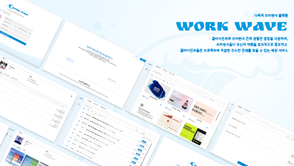
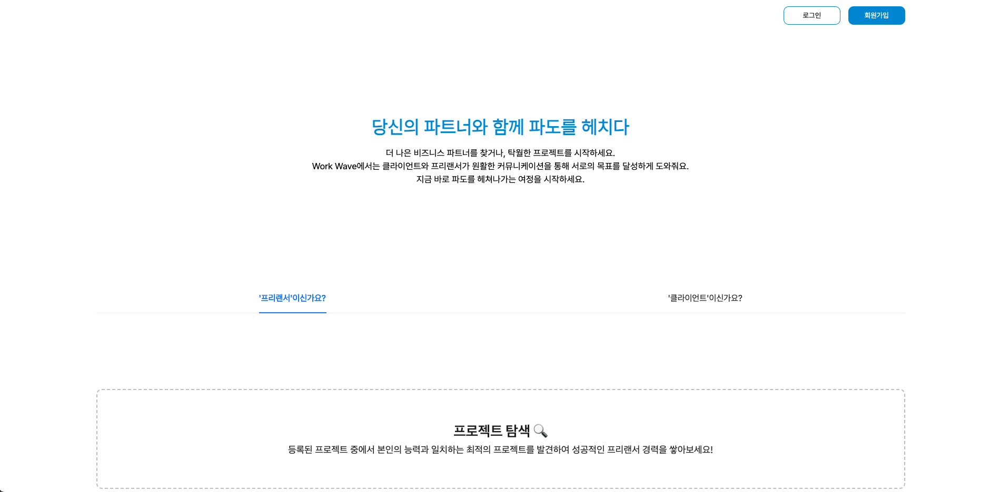
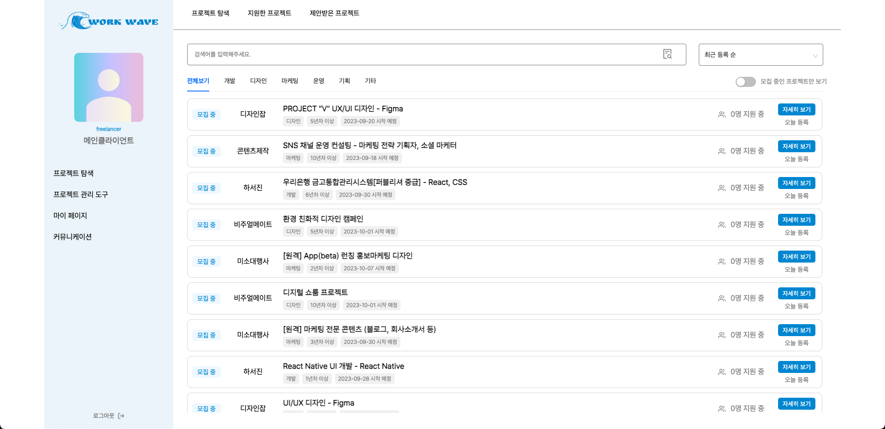
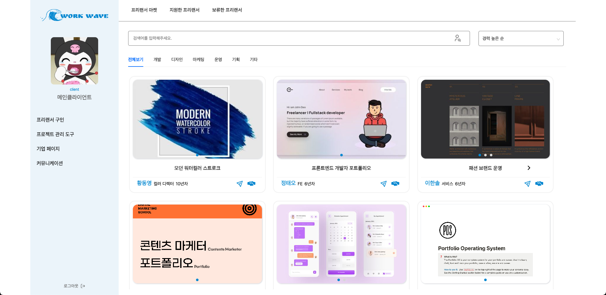

# React,TS 팀 프로젝트 "Work Wave"

## 🖥️ 프로젝트 소개

#### - 프리랜서와 클라이언트 매칭 플랫폼입니다.

    1. 프리랜서모드 / 클라이언트모드로 각각 로그인하여 접속한다.
    2. 프리랜서모드에서는 본인의 프로필, 포트폴리오(pdf, 링크)를 게시한다.
    3. 클라이언트모드에서는 기업 구성원을 추가하고, 프로젝트를 게시한다.
    4. 클라이언트가 게시한 프로젝트에 프리랜서가 지원하고 클라이언트가 수락을 누르면, 프리랜서 <-> 클라이언트가 매칭된다.
    5. 프로젝트 관리 도구 탭에서 프리랜서와 클라이언트가 프로젝트 진행상황을 공유할 수 있다.
    6. 커뮤니케이션 탭에서 프리랜서와 클라이언트가 실시간으로 의견을 교환하고, 프로젝트의 세부 사항을 논의할 수 있다.

## 📜 [S.A(Starting Assignments)](https://www.notion.so/86dbcf1f59274d9eaf2c5247cb73644a?pvs=4)

## 🎬 [Work Wave](https://work-wave-git-main-jinsollee2023.vercel.app/)

## ⏰ 개발 기간

- 2023/08/16 ~ 2023/09/18

## 🧑‍🤝‍🧑 맴버 구성 및 역할 분담

| 이름   |          | 역할   |
| ------ | -------- | ------ |
| 이진솔 | 리더     | update |
| 이한별 | 부리더   | update |
| 박제이 | 팀원     | update |
| 이안진 | 팀원     | update |
| 정승하 | 팀원     | update |
| 임지훈 | 디자이너 | update |

## 🖨️ 개발 프로세스 가이드

1.  CRA 프로젝트 셋업
2.  .prettierrc 파일 만들기
3.  Firebase 셋업 (서버 및 DB 셋업)
4.  환경변수(.env) 셋업
5.  git 브렌치 관리 권장사항

## 🛠️ 화면 구성

### Welcome

Work Wave 사이트 소개 및 이용 방법을 확인할 수 있으며, 프리랜서 / 클라이언트 회원가입 및 로그인을 할 수 있다.

### 프리랜서

> 프로젝트 탐색

- 프로젝트 탐색 : 클라이언트가 등록한 프로젝트를 확인 / 지원할 수 있다.
- 지원한 프로젝트 : 본인이 지원한 프로젝트 목록을 확인하고 지원 취소할 수 있다.
- 제안받은 프로젝트 : 클라이언트가 제안한 프로젝트 목록을 확인하고 수락, 거절할 수 있다.

> 프로젝트 관리 도구

- 프로젝트 진행 상태 : 계약이 체결된 프로젝트의 진행 상태를 기록할 수 있다.

> 마이 페이지

- 개인정보 : 개인 정보(프로필 사진, 이름, 직무 분야, 세부 분야, 전화번호)를 수정하거나 탈퇴할 수 있다.
- 이력서 : 프로필, 경력사항을 추가, 수정, 삭제할 수 있다.
- 포트폴리오 : 포트폴리오 등록, 수정, 삭제를 할 수 있다.
- 계약정보 : 현재까지 계약된 프로젝트 이력을 확인할 수 있다.

> 커뮤니케이션

- 커뮤니케이션 : 클라이언트와 실시간으로 의견을 교환하고, 프로젝트의 세부 사항을 논의할 수 있다.

### 클라이언트

> 프리랜서 구인 페이지

- 프리랜서 마켓 : 가입된 모든 프리랜서의 정보를 확인하고, 메세지를 발송하거나 프로젝트를 제안할 수 있다.
- 지원한 프리랜서 확인 : 등록한 프로젝트에 지원한 프리랜서 목록을 확인, 계약, 보류할 수 있다.
- 보류한 프리랜서 : 프로젝트에 지원한 프리랜서 중, 보류한 프리랜서 목록을 확인하고, 계약 혹은 거절할 수 있다.

> 프로젝트 관리도구 Page

- 프로젝트 목록 : 프로젝트 등록, 수정, 삭제를 할 수 있으며, 현재까지 등록된 프로젝트 목록을 확인할 수 있다.
- 프로젝트 진행상태 : 계약이 체결된 프로젝트의 진행 상태를 확인 및 종료를 할 수 있다.

> 기업 페이지

- 개인정보 : 개인 정보(프로필 사진, 이름, 전화번호)를 수정하거나 탈퇴할 수 있다.
- 우리 기업 구성원 : 기업의 구성원을 등록, 수정, 삭제할 수 있다.
- 진행 중인 프리랜서 : 현재 진행중인 프로젝트와 프리랜서의 정보를 확인할 수 있다.
- 계약이 끝난 프리랜서 : 계약이 끝난 프로젝트와 프리랜서 정보를 확인할 수 있고, 해당 프리랜서에게 다시 한 번 프로젝트를 제안할 수 있다.

> 커뮤니케이션

- 커뮤니케이션 : 프리랜서와 실시간으로 의견을 교환하고, 프로젝트의 세부 사항을 논의할 수 있다.

## ⚙️ 개발 환경 / 기술스택

- TS
- React
- Zustand
- Supabase
  - storage
  - auth
- Styled-components
- JavaScript
- HTML

## ⚔️ Trouble Shooting

> 캐러셀

    - 💡 상황 : 프리랜서 마켓 -> 포트폴리오를 보기 편하게 보여주기 위해 캐러셀 기능이 필요했음
    - ❓ 문제 : react-carousel을 사용하려 했으나 <Carousel> 태그 내부에서 중괄호 { } 내부에 javascript 코드를 작성하여 map과 filter 함수를 사용하고 데이터를 가공하고 싶었으나 해당 코드 작성 시 오류가 발생하였고, slider 버튼과 위치 등의 자유로운 커스텀이 힘들었음.
    - ✅ 해결 방법 : 포트폴리오 slider를 react-carousel 라이브러리를 사용하지 않고 useState를 이용하여 직접 구현

> 채팅 CRUD

    - 💡 상황 : 채팅 기능을 구현하던 중, 코드상으로 문제가 없으나 채팅 데이터가 insert 되지 않음
    - ❓ 문제 : supabase RLS 및 policy를 책정하지 않음
    - ✅ 해결 방법 : RLS 설정한 테이블의 경우, insert, select, update, delete별로 policy 설정을 해줌

> 채팅 insert

    - 💡 상황 : 코드상 문제가 없고, policy 설정도 해주었으나 채팅 데이터가 insert 되지 않음
    - ❓ 문제 : security invoker, security definer 설정을 제대로 해주지 않음
    - ✅ 해결 방법 : 로그인 후 security definer로 권한 바꾼 후, RLS access level을 조정함

> 무한 스크롤

    - 💡 상황 : 많은 데이터들을 특정 갯수로 끊어서 데이터를 불러오기 위해 무한 스크롤 기능을 구현하는 과정에서 필요한 데이터가 아니라 다른 여러 데이터도 같이 불러와짐
    - ❓ 문제 : 여러 개의 쿼리 함수들을 hook 폴더 안에 하나의 queries 파일에 묶어져 있어 해당 파일 내의 모든 get 함수들이 같이 호출되고 있었음
    - ✅ 해결 방법 : 각 용도별로 queries 파일을 생성하고 필요한 쿼리를 해당 파일로 이동하여 useQueries를 import 하는 곳에서 필요한 쿼리 파일만 불러오도록 수정함

> 유저 테스트 반영

    - ❓ 문제 : 로그인, 회원가입을 진행해야 이용할 수 있는 폐쇄형 서비스이며, 서비스 이용 방법을 잘 모르겠다는 유저의 피드백이 다수 발생
    - ✅ 해결 방법 : 사이트에 진입하면 바로 보일 수 있는 랜딩페이지를 제작하여 주요 기능들을 소개함
